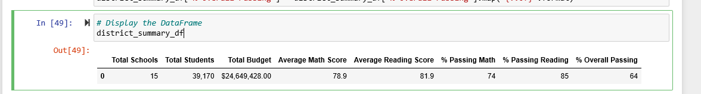

# School_District_Analysis
School District Analysis Anaconda/Python
Scope of Project 

Gather the following data using the CSV file provided  : 
* Clean, merge and analyze data
* Generate school district summary 
    * Calculate total number of students - 39,170
    * Calculate total number of schools - 15 
    * Calculate the total budget - 24,649,428
    * Calculate the score averages 
        * Math - 78.99%
        * Reading 81.88%
    * Calculate the passing percentages
        * Math - 74.98 %
        * Reading - 85.81%
    * Create a district summary DataFrame
    * 
	
 * Generate the School Summary 
    * Calculate student count per school    
    * Calculate budget per student
    * Calculate average per school   	
    * Calculate passing percentages per school    	 
    * Create the school summary DataFrame
    	
    
 * Cateorize High and Low Performing Schools 
     * Identify highest performing schools
     	 	
    * Identify lowest performing schools
    	    
	
 * Average math and reading scores by grade - 
    * Score averages grouped by school name    
    * Create grade level DataFrames 
    * Group scores by school spending per student
    * Establish spending ranges per student
    * Categorize spending bins
    * Group by the spending binsGroup by spending ranges
    * Create a DataFrame for the scores by school spending
    	
    	
 * Group score by school size 
   * Create Bins for school size
   * Categorize bin sizes
   * Group by school size
   * Creat a DataFrame for the scores by school size
    	
	
 * Group by school type 
    * Group by school type
    * Create a DataFrame for the scores by school type
    	
	
 ## Challenge 
 Replace all Thomas High School 9th grade students reading and math scores with NaN due to irregularities in testing scores. Still use total numbers of students and other data for analysis. 
 
 ## Findings 
 * After replacing the Thomas High School 9th grade reading and math scores with NaN. The following was observed for the average scores and percentages passed :
    * The average math score went from a 78.99 to a 78.93 and the passing percentage went from a 74.98% to 73.88%
    * The average reading score went from 81.88% to 81.55% and the passing percentage went from 85.81% to 84.65%
    * All other variables remained constant from the previous analysis in the district summary as observed below.
    	
    * School Summary Data the revised data only impacted the data for Thomas High School on the school summary. You can observe that average math score, average reading score vary only slightly. Passing percentage math, reading and overall are significantly impacted. Passing percentages were in the 90's in the original analysis dropping to 60's in the revision. 
 	

    * Top five schools varied while 5 bottom schools stayed consistent. Thomas High School was originally listed as second and with the revised data drops off the top five.
    	
    * Lower Bottom is unchanged 
    * Schools by school spending for Thomas High School was altered with the new data. The new data set illustrates the same amount of spending for the school but reflects the new lower grades and much lower passing percentages. 
    * The same for scores by school size the new lower schools replace the previous scores for Thomas High School while school size is unchanged. 
    
    * Also the Averages for Medium size school decrease and do the averages per charter school. 
    	
	
    
    

## Resources
students_complete.csv, schools_complete.csv
Python version 3.8.3 , Anaconda 

